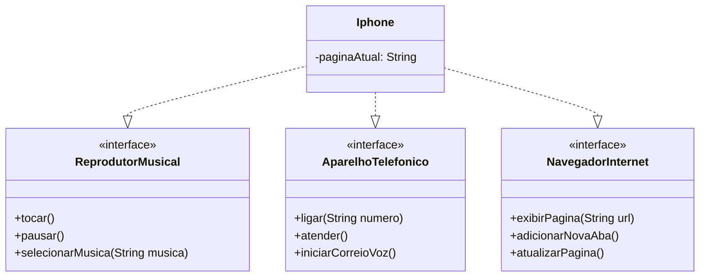

<h1> Desafio de Modelagem UML - Componente iPhone </h1>

## 📝 Descrição do Projeto
Este projeto é uma solução para o desafio de modelagem e programação da Digital Innovation One (DIO). O objetivo foi abstrair as funcionalidades de um iPhone, com base em sua apresentação de lançamento em 2007, e traduzir essa abstração em um diagrama UML e em código Java funcional.

O design se concentra em modelar o iPhone como um dispositivo multifuncional, que desempenha diferentes papéis (Reprodutor Musical, Aparelho Telefônico e Navegador de Internet) através do uso de Interfaces, demonstrando um dos princípios fundamentais da Programação Orientada a Objetos.

## 🧠 Conceitos Aplicados
Abstração: Foco nas características essenciais de cada funcionalidade.

Encapsulamento: Ocultamento dos detalhes internos de implementação dentro da classe Iphone.

Interfaces: Definição de "contratos" para cada papel que o iPhone desempenha, promovendo baixo acoplamento e flexibilidade.

Polimorfismo: Capacidade do único objeto Iphone de ser tratado como ReprodutorMusical, AparelhoTelefonico ou NavegadorInternet, dependendo do contexto.

Princípio da Segregação de Interfaces (ISP): Criação de interfaces específicas para cada funcionalidade, evitando que uma classe implemente métodos que não utiliza.

## 🛠️ Tecnologias Utilizadas
### Java 17

### UML (Linguagem de Modelagem Unificada)

### Mermaid (Sintaxe para gerar diagramas a partir de texto)

📊 Diagrama UML
O diagrama abaixo representa a estrutura de classes e interfaces do projeto. A classe Iphone é a implementação concreta que "assina os contratos" das três interfaces, herdando a responsabilidade de implementar seus métodos.

